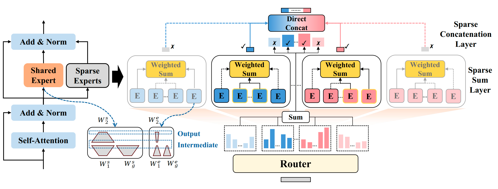

<p align="center">

<p>

# FineRMoE: Dimension Expansion for Finer-Grained Expert with Its Upcycling Approach

<div align="center"> 

[](https://arxiv.org/pdf/2603.13364)
[](https://huggingface.co/collections/NingLiao/finermoe)
</div>

## ⭐️ Introduction

To break the performance ceiling of fine-grained MoE designs that are solely confined to the intermediate dimension, which has been revealed by the [scaling law of MoE](https://arxiv.org/pdf/2507.17702), we introduce the **FineRMoE (FineR-grained MoE)** architecture. It pioneers the expansion of the fine-grained expert design in MoE models from only the intermediate dimension to the output dimension, aiming to enhance expert specialization beyond the single-dimension limit. The core contributions of this work include:

- Finer-grained expert design across intermediate and output dimensions;
- Bi-level sparse forward computation paradigm for multi-expert fusion;
- Unified routing mechanism with one router governing two sparse layers;
- Generalized upcycling compatible with FineRMoE and conventional MoEs.

In this repository, we open source the implementation of the FineRMoE architecture, the training code based on the Megatron-LM framework, the implementation of the upcycling method, and the model weights of the FineRMoE built on [Qwen2.5](https://huggingface.co/collections/Qwen/qwen25).

## ⚙️ Installation

The upcycling and training of the FineRMoE is implemented based on the [Pai-Megatron-Patch](https://github.com/alibaba/Pai-Megatron-Patch) repository. To run our code, the recommended image is: `dsw-registry.cn-wulanchabu.cr.aliyuncs.com/pai/pai-megatron-patch:25.01`.

## 🚀 QuickStart

### 1. Upcycling from Dense Model to FineRMoE & Huggingface to Megatron Weight Convert

The entry script of upcycling a dense pre-trained model into FineRMoE together with converting the weight format from huggingface to megatron is `toolkits/model_checkpoints_convertor/FineRMoE/ckpt_convert_utils/hf2mcore_finermoe.sh`. The required parameters in the script are demonstrated as below:

```bash
MODEL_SIZE=${1}                     # the size of base dense pre-trained models: A7B, UpFrom0.5B, UpFrom1.5B
SOURCE_CKPT_PATH=${2}               # the path of pre-trained weights of the dense model in huggingface format
T_I=${3}                            # number of activated experts within each group in the sparse sum layer
TP=${4}                             # tensor parallelism
PP=${5}                             # pipeline parallelism
ETP=${6}                            # expert tensor parallelism
EP=${7}                             # expert parallelism
PR=${8}                             # precision
SHARED_EXPERT_INIT=${9}             # the method for initializing shared expert: copy, noshare
ROUTED_EXPERT_INIT=${10}            # the method for initializing sparse expert: copy, finermoe, all_normal
ROUTER_INIT=${11}                   # the method for initializing router: normal
FINE_PARAM=${12}                    # the four hyper-parameters in FineRMoE, following the format by G_I-G_O-R_I-R_O
MG2HF=${13}                         # whether performing megatron to huggingface convert
HF_CKPT_PATH=${14}                  # the path of the huggingface modeling of FineRMoE
force_init=${15}                    # whether perform convert if the target model exists
concat_proj=${16}                   # whether add the linear projection layer after the concatenation in FineRMoE
CONCAT_PROJ_INIT=${17}              # the method for initializing the linear projection layer: normal
BASE_PATH=${18}                     # the path of saving converted model in megatron format
```

We provide a huggingface to megatron convert example as below:

```bash
cd toolkits/model_checkpoints_convertor/FineRMoE/ckpt_convert_utils
bash hf2mcore_finermoe.sh \
UpFrom1.5B \
/your/path/of/official/Qwen2.5-1.5B \
1 \
1 \
2 \
1 \
8 \
bf16 \
copy \
finermoe \
normal \
32-2-1-2 \
false \
toolkits/model_checkpoints_convertor/FineRMoE/ckpt_convert_utils/FineRMoE \
false \
false \
normal \
/you/save/path/of/converted/megatron/model
```
### 2. Training of FineRMoE

The entry script of training the FineRMoE is `examples/FineRMoE/run_FineRMoE_multinode.sh`. The required parameters in the script are demonstrated as below:

```bash
ENV=${1}                            # the setting of training enviroments, dlc for single node, dsw for multinode.
MODEL_SIZE=${2}                     # the size of base dense pre-trained models: A7B, UpFrom0.5B, UpFrom1.5B.
BATCH_SIZE=${3}                     # the micro batch size.
GLOBAL_BATCH_SIZE=${4}              # the global batch size.
LR=${5}                             # the learning rate.
MIN_LR=${6}                         # the minimum learning rate.
SEQ_LEN=${7}                        # the training sequence length.
PAD_LEN=${8}                        # the training padding length.
PR=${9}                             # the training precision.
TP=${10}                            # tensor parallelism
PP=${11}                            # pipeline parallelism
CP=${12}                            # context parallelism
ETP=${13}                           # expert tensor parallelism
EP=${14}                            # expert parallelism
SP=${15}                            # whether using sequence parallelism: true, false
DO=${16}                            # whether using the Zero-1 GPU memory optimization of Megatron: true, false
FL=${17}                            # whether using the Flash Attention: true, false
SFT=${18}                           # whether performing supervised fine-tuning: true, false
AC=${19}                            # the pattern of activation checkpointing: sel, full, offload, false
OPTIMIZER_OFFLOAD=${20}             # whether using Offload optimizer: false, static, auto
SAVE_INTERVAL=${21}                 # interval of saving checkpoints
DATASET_PATH=${22}                  # the path of training data
VALID_DATASET_PATH=${23}            # the path of validation data
PRETRAIN_CHECKPOINT_PATH=${24}      # the path of the pre-trained model, which is obtained by the above upcycling
TRAIN_TOKENS=${25}                  # number of training tokens
WARMUP_TOKENS=${26}                 # number of warmup tokens
OUTPUT_BASEPATH=${27}               # base path of the training output
FREEZE_BACKBONE=${28}               # whether freezing the pre-trained backbone: true, false
RESUME=${29}                        # whether resume training if training interruptted
```

We provide a training example as below:

```bash
cd examples/FineRMoE/
bash run_FineRMoE_multinode.sh \
dsw \
A7B \
1 \
2048 \
1e-5 \
1e-7 \
8192 \
8192 \
bf16 \
1 \
2 \
1 \
1 \
8 \
true \
true \
true \
false \
sel \
false \
200 \
/your/path/of/data/mmap/::01:1-02:1 \
None \
/your/path/of/FineRMoE/upcycled/and/converted/as/megatron/format \
50000000000 \
500000000 \
/your/save/path \
false \
true
```

### 3. Megatron to Huggingface Weight Convert of FineRMoE

The entry script of converting the trained FineRMoE from megatron to huggingface format is `toolkits/model_checkpoints_convertor/FineRMoE/mcore2hf_convert.sh`. The required parameters in the script are demonstrated as below:

```bash
MCORE_PATH=${1}                     # the path of the trained FineRMoE weights in megatron format
model_size=${2}                     # the size of base dense pre-trained models: A7B, UpFrom0.5B, UpFrom1.5B
MODELING_PATH=${3}                  # the path of the huggingface modeling of FineRMoE
DENSE_ARCH_PATH=${4}                # the path of base dense pre-trained model
BASE_PATH=${5}                      # the directory path of the converted FineRMoE in huggingface format
```

We provide a megatron to huggingface convert example as below:

```bash
cd toolkits/model_checkpoints_convertor/FineRMoE/
bash mcore2hf_convert.sh \
/your/path/of/trained/FineRMoE/in/Megatron/format \
'UpFrom1.5B' \
toolkits/model_checkpoints_convertor/FineRMoE/ckpt_convert_utils/FineRMoE \
/your/path/of/official/Qwen2.5-1.5B \
/your/save/path
```

## 🤗 Model Weights
**The FineRMoE built based on Qwen2.5-0.5/1.5/7B with 50B tokens trained are provided as below.**
| Model | Total Param | Activated Param | Total Experts | Activated Experts |
|-------|-------------|-----------------|-----------------|-----------------|
| [🤗 FineRMoE-1.68B-A0.65B](https://huggingface.co/NingLiao/FineRMoE-1.68B-A0.65B) | 1.68 B | 0.65 B | 128 | 2 |
| [🤗 FineRMoE-5.64B-A1.85B](https://huggingface.co/NingLiao/FineRMoE-5.64B-A1.85B) | 5.64 B | 1.85 B | 128 | 2 |
| [🤗 FineRMoE-26.65B-A7.94B](https://huggingface.co/NingLiao/FineRMoE-26.65B-A7.94B) | 26.65 B | 7.94 B | 128 | 2 |

## 🎄 Acknowledgement

We acknowledge the contributors of the [Pai-Megatron-Patch](https://github.com/alibaba/Pai-Megatron-Patch) repository, the well-developed and mantained framework lay the foundation of the FineRMoE.

## 📖 Citation

If you find our work helpful, feel free to give us a cite.
```
@misc{liao2026finermoedimensionexpansionfinergrained,
      title={FineRMoE: Dimension Expansion for Finer-Grained Expert with Its Upcycling Approach}, 
      author={Ning Liao and Xiaoxing Wang and Xiaohan Qin and Junchi Yan},
      year={2026},
      eprint={2603.13364},
      archivePrefix={arXiv},
      primaryClass={cs.CV},
      url={https://arxiv.org/abs/2603.13364}, 
}
```
